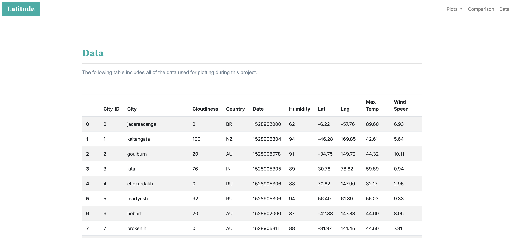

### Project: Webpage using HTML, CSS with Bootstrap
## This project had the purpose of creating a web dashboard using HTML and CSS3 enhanced with Bootstrap. Be aware that the text filled in this project was a dummy text generated by this page.

### CSS in action:
## All pages were developed to resize layout, which means, based on the browser size, the page shows a different layout.
## Besides Boostrap there is another style.css which gives more personality for this web dashboard

### Converting CSV file to Pandas data frame:

## Converting HTML tables to dataframe:

## Data-set display after HTLM concversion:

### Webpages Layout:

## The below display when the browser is in a desktop layout.

### Features:
## HTML
## CSS with Bootstrap 4
## Jupyter Notebook
## Python with Pandas

  ## Link to the webpage: https://ejosephsr.github.io/Web-Design-Challenge/.
